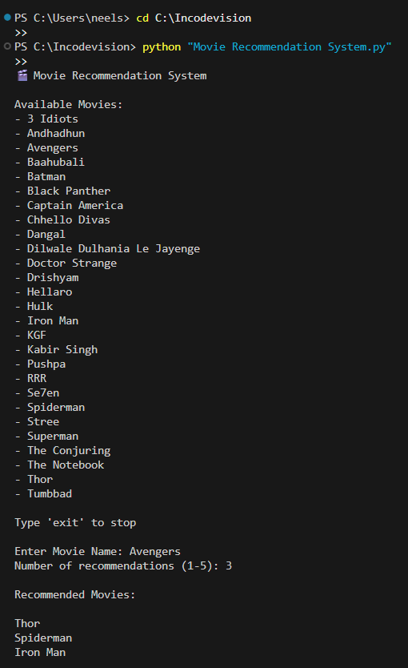

# Movie-Recommendation-System

Movie Recommendation System using Machine Learning and Content-Based Filtering.

# Features
- Movie recommendation using TF-IDF
- Cosine similarity based suggestion
- Dynamic movie addition
- CSV dataset support

# Technologies Used
- Python
- Pandas
- Scikit-learn

# How to Run
1. Install required libraries:
pip install pandas scikit-learn

2. Run the program:
python Movie Recommendation System.py

## Output

